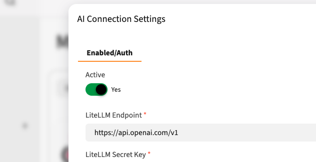

# Mautic AI Connection Bundle


A core AI connection plugin for Mautic that manages LiteLLM integration and provides centralized AI services for all Mautic AI-powered plugins.

## Overview

The Mautic AI Connection Bundle serves as the foundation for AI functionality in Mautic. It provides a centralized LiteLLM service that can be used by other AI-powered plugins such as:

- **Mautic AI Console** - AI-powered console interface with voice input
- **Mautic AI Reports** - AI-powered report generation
- **Mautic AI Eval** - AI evaluation features

## Features

- **Centralized AI Configuration** - Single source of truth for LiteLLM endpoint and credentials
- **LiteLLM Integration** - Connect to multiple AI providers (OpenAI, Anthropic Claude, Llama, etc.) through LiteLLM proxy
- **Shared Service Architecture** - Other plugins access AI capabilities through this bundle's service
- **Model Management** - Dynamically fetch available models from your LiteLLM instance
- **Secure Credential Storage** - API keys are encrypted and stored securely

## Requirements

- Mautic 4.0+ or Mautic 5.0+
- PHP 7.4 or 8.0+
- A running LiteLLM instance (proxy server)

## Installation

### Via Composer

```bash
composer require mautic/ai-connection-bundle
```

### Manual Installation

1. Download or clone this repository
2. Place the `MauticAIconnectionBundle` folder in `docroot/plugins/`
3. Clear Mautic cache:
   ```bash
   php bin/console cache:clear
   ```
4. Go to Mautic Settings → Plugins
5. Click "Install/Upgrade Plugins"
6. Find "Mautic AI Connection" and publish it

## Configuration

Navigate to **Mautic Settings → Plugins → Mautic AI Connection** to configure the plugin.



### Required Settings

1. **LiteLLM Endpoint**
   - URL of your LiteLLM proxy server or an OPENAI API key.
   - Example: `http://localhost:4000` or `https://your-litellm-server.com` or https://api.openai.com/v1
   - **Note:** This should point to your LiteLLM proxy, NOT directly to OpenAI or other providers

2. **LiteLLM Secret Key**
   - API key for authenticating with your LiteLLM instance or Openai.
   - This credential is encrypted and stored securely

## LiteLLM Setup

This plugin requires a LiteLLM proxy server. LiteLLM acts as a unified interface to multiple AI providers.

### What is LiteLLM?

LiteLLM is a proxy server that provides a unified API for 100+ LLMs including:
- OpenAI (GPT-3.5, GPT-4)
- Anthropic (Claude)
- Google (Gemini)
- Meta (Llama)
- And many more...

### Quick LiteLLM Setup

1. **Install LiteLLM:**
   ```bash
   pip install litellm[proxy]
   ```

2. **Create a config file** (`litellm_config.yaml`):
   ```yaml
   model_list:
     - model_name: gpt-3.5-turbo
       litellm_params:
         model: openai/gpt-3.5-turbo
         api_key: your-openai-key

     - model_name: claude-3-sonnet
       litellm_params:
         model: anthropic/claude-3-sonnet-20240229
         api_key: your-anthropic-key
   ```

3. **Start LiteLLM:**
   ```bash
   litellm --config litellm_config.yaml --port 4000
   ```

4. **Configure this plugin** with:
   - Endpoint: `http://localhost:4000`
   - Secret Key: (your master key if configured, or leave empty for local development)

## Usage in Other Plugins

Other Mautic plugins can use the LiteLLM service provided by this bundle.

### Accessing the Service

```php
// Get the service from the container
$liteLLMService = $this->container->get('mautic.ai_connection.service.litellm');
```

### Available Methods

#### 1. Chat Completion (with tools support)

```php
$messages = [
    ['role' => 'system', 'content' => 'You are a helpful assistant.'],
    ['role' => 'user', 'content' => 'What is Mautic?'],
];

$options = [
    'model' => 'gpt-3.5-turbo',
    'temperature' => 0.7,
    'max_tokens' => 1000,
];

$response = $liteLLMService->getChatCompletion($messages, $options);
```

#### 2. Simple Completion

```php
$response = $liteLLMService->getCompletion('Explain marketing automation in 50 words');
```

#### 3. Streaming Completion

```php
$liteLLMService->streamCompletion('Write a blog post about email marketing', function($chunk) {
    echo $chunk;
});
```

#### 4. Speech-to-Text

```php
$audioData = file_get_contents('recording.wav');
$transcription = $liteLLMService->speechToText($audioData, 'en', 'whisper-1');
```

#### 5. Get Available Models

```php
$models = $liteLLMService->getAvailableModels();
// Returns: ['GPT-4' => 'gpt-4', 'Claude 3' => 'claude-3-sonnet', ...]
```

### Subscribing to the Service in Controllers

```php
use MauticPlugin\MauticAIconnectionBundle\Service\LiteLLMService;

class YourController extends CommonController
{
    public static function getSubscribedServices(): array
    {
        return array_merge(parent::getSubscribedServices(), [
            'mautic.ai_connection.service.litellm' => LiteLLMService::class,
        ]);
    }

    public function yourAction()
    {
        $liteLLMService = $this->container->get('mautic.ai_connection.service.litellm');
        // Use the service...
    }
}
```

## Architecture

This plugin follows a centralized service architecture:

```
┌─────────────────────────────────────┐
│   Mautic AI Connection Bundle       │
│  ┌───────────────────────────────┐  │
│  │   LiteLLM Service             │  │
│  │  - Chat Completions           │  │
│  │  - Streaming                  │  │
│  │  - Speech-to-Text             │  │
│  │  - Model Discovery            │  │
│  └───────────────────────────────┘  │
└─────────────────────────────────────┘
              ↑ ↑ ↑
              │ │ │
    ┌─────────┘ │ └─────────┐
    │           │           │
┌───┴────┐ ┌───┴────┐ ┌───┴────┐
│AI      │ │AI      │ │AI      │
│Console │ │Reports │ │Eval    │
│Bundle  │ │Bundle  │ │Bundle  │
└────────┘ └────────┘ └────────┘
```

## Composer Dependency

Other AI plugins should declare this bundle as a dependency in their `composer.json`:

```json
{
    "require": {
        "mautic/ai-connection-bundle": "^1.0"
    }
}
```

## Security

- API keys are encrypted using Mautic's encryption helper
- All requests use HTTPS when connecting to remote LiteLLM instances
- The service validates configuration before making API calls

## Troubleshooting

### "LiteLLM endpoint and secret key must be configured"

**Solution:** Configure the LiteLLM endpoint and secret key in the plugin settings.

### "404 Not Found" when making AI requests

**Issue:** The endpoint is pointing directly to OpenAI/Anthropic instead of LiteLLM proxy.

**Solution:** Ensure you're using your LiteLLM proxy URL (e.g., `http://localhost:4000`), not `https://api.openai.com`.

### Models not appearing in dropdown

**Issue:** LiteLLM instance is not reachable or not properly configured.

**Solution:**
1. Verify LiteLLM is running: `curl http://localhost:4000/models`
2. Check endpoint URL in plugin settings
3. Verify secret key is correct

## Development

### Running Tests

```bash
php bin/phpunit --filter MauticAIconnectionBundle
```

### Code Style

Follow Mautic coding standards:
```bash
php bin/php-cs-fixer fix plugins/MauticAIconnectionBundle
```

## Support

- GitHub Issues: [Report an issue](https://github.com/yourusername/mauticorangepoc/issues)
- Mautic Community: [community.mautic.org](https://community.mautic.org)
- Documentation: [LiteLLM Docs](https://docs.litellm.ai/)

## License

GPL-3.0-or-later

## Credits

Created by Frederik Wouters

## Version

1.0.0

## Changelog

### 1.0.0 (2024)
- Initial release
- LiteLLM service integration
- Chat completion support
- Streaming support
- Speech-to-text support
- Model discovery
- Secure credential storage
